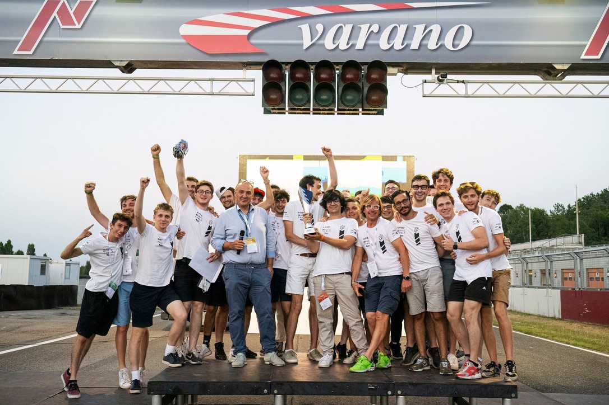

I'm an Electronics Engineering student at the University of Udine, Italy.
My interests range from hardware design to software development: I like developing firmware for the devices I design, and when it's necessary I also love to develop mobile companion apps.

I am a fan of modern development tools and technologies, and I really enjoy seeing them applied to the embedded world: all my recent firmware projects are written in Rust, without depending on any special toolchain or development environment. Why should embedded development be any different from the rest of the software world?

In my free time, I develop apps for Apple platforms, in particular with SwiftUI and UIKit, although I'd really like to learn more about AppKit and Objective-C.

Even if I do some web development, I don't really like it: I prefer to use native technologies whenever it makes sense.

I might have started to actually like Python for _some_ reason...

## Education

- ***University of Udine*** - Master's degree in Electronics Engineering - Current
- ***University of Udine*** - Bachelor's degree in Electronics Engineering - 2023
- ***Istituto Tecnico Industriale "A. Malignani"*** - High school diploma in Electronics - 2019

## Work and team experience

- ***Internship*** at [DM Elektron](http://www.dmelektron.com/): Component database migration.
- ***Internship*** at [DM Elektron](http://www.dmelektron.com/): Hardware debugging and testing.
- ***2021/2022 member*** of [UNIUD E-Racing Team](https://formulasae.uniud.it/): Head of Electronics department.
- ***2022/2023 member*** of [UNIUD E-Racing Team](https://formulasae.uniud.it/): Firmware developer.
- ***2023/2024 member*** of [UNIUD E-Racing Team](https://formulasae.uniud.it/): Firmware developer.
- ***Internship*** at [Apple Inc.](http://apple.com/): RF Systems Engineering intern.

## Awards

- ***2nd place*** at the [2018 Italian National Electronics Competition](http://www.garanazionaleelettronica.it/la-storia/).
- ***Selected*** as a [2021 Apple Swift Student Challenge](https://github.com/persello/ssc21) winner.
- ***Selected*** as a [2022 Apple Swift Student Challenge](https://github.com/persello/ssc22) winner.

## Contact information

- ***Email*** [riccardo.persello@icloud.com](mailto:riccardo.persello@icloud.com)
- ***GitHub*** [persello](https://github.com/persello)
- ***LinkedIn*** [riccardo-persello](https://www.linkedin.com/in/riccardo-persello/)

---

---

This website is built with [Zola](https://www.getzola.org/), a static site generator written in Rust 🦀.
