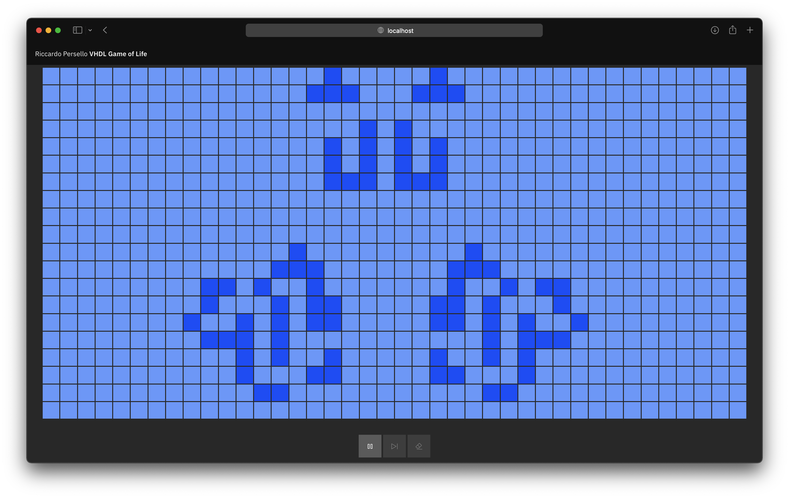

## Overview

An interactive web-app that drives a VHDL backend to simulate Conway's Game of Life.

This is the final project for the "Embedded Systems" course at the University of Udine.
It demostrates various aspects of the course, including:

- VHDL
- Object-oriented programming
- Containerisation
- Unit testing
- Shell scripting



## Architecture

The project is made of two Docker containers, one for the frontend and one for the backend.
The frontend is a Svelte app, while the backend is a Python script that runs a VHDL simulation.

### Communication

The frontend communicates with the backend via a simple REST API.
The backend exposes three endpoints:

- `POST /step`: runs a single step of the simulation.
- `GET/POST /state`: returns/sets the current state of the simulation (matrix of boolean values).
- `GET /board-size`: returns the size of the simulation board (tuple of integers).

### Frontend

The frontend is a single-page Svelte app that uses the IBM Carbon Design System. It is built with the `carbon-components-svelte` package.
The board shown in the frontend is sized dynamically, depending on the size of the board defined in the VHDL code.

This is a good example of modularisation: the frontend is completely independent from the backend, and it can be used with any board size. In fact, for changing the board size, you only need to change the VHDL code, and the frontend will automatically adapt.

The frontend's requests are made through a generated TypeScript client, which comes from the OpenAPI specification provided by the backend.
This way, the types of the requests and responses are automatically managed, eliminating the risk of human errors. Request functions will accept and return only the correct types, and the IDE will provide autocompletion.

For example, setting the state of the board is done with the following function:

```typescript
function userChangedWorld(world: boolean[][]) {
    board_state = ServiceVHDLBackend.setBoardState(world);
    console.log(world);
}
```

The state is saved in a local variable, and passed to a [`world`](https://github.com/persello/game-of-life-vhdl/blob/master/frontend/src/components/world.svelte) component, which is responsible for rendering the board. This component is made of a grid of cells, which are bound to the state of their specific index. Each cell also receives a callback function, which is called when the user clicks on it.

Last, there are a few buttons that allow the user to control the simulation: autoplay, step and erase.

### Backend

The backend runs a Python script which starts by running `make`, which starts an interactive GHDL session with undefined simulation time.

In the meantime, the REST API is initialised. Starting the simulation takes a few seconds, so it will return errors until ready.
The frontend will simply hide the board until GHDL becomes interactive.

When the VHDL simulation outputs a ready signal, its controlling class will complete the initialisation.
This class, [`VHDLBackend`](https://github.com/persello/game-of-life-vhdl/blob/master/backend/api/VHDLBackend.py), exposes a clean Python interface to communicate with GHDL.

```python
class VHDLBackend:
    """
    VHDL backend management class.
    """

    def get_board_size(self) -> Tuple[int, int]:
        # ...

    def get_board_state(self) -> List[List[bool]]:
        # ...

    def set_board_state(self, board_state: List[List[bool]]):
        # ...

    def step(self):
        # ...

```

Internally, it uses single-letter commands followed by some arguments, which can bea easily parsed in the VHDL testbench.

On the VDHL side, the code is organised in three different entities:

- a [`ones_counter`](https://github.com/persello/game-of-life-vhdl/blob/master/backend/entities/ones_counter.vhdl) entity, which counts the number of ones in a given vector.
- a [`cell`](https://github.com/persello/game-of-life-vhdl/blob/master/backend/entities/cell.vhdl) entity, which represents a single cell of the board.
- a [`world`](https://github.com/persello/game-of-life-vhdl/blob/master/backend/entities/world.vhdl) entity, which uses two nested generate loops to create a matrix of cells.

Each of these entities has a testbench that defines some test cases. These tests are run by [VUnit](https://vunit.github.io/), which is a Python library for unit testing VHDL code.

There is a fourth, special testbench, that is the one which is actually run by the Python script, called [`world_tb_interactive`](https://github.com/persello/game-of-life-vhdl/blob/master/backend/entities/world_tb_interactive.vhdl). This testbench runs an I/O loop that receives commands from the standard input. The commands are dispatched by looking at the first character:

- `s`: runs a single step of the simulation.
- `l`: loads a new board state.
- `p`: prints the current board state.
- `x`: returns the x-size of the board.
- `y`: returns the y-size of the board.

The `l` and `p` commands expect (or output) data after a newline, as a sequence of ones and zeros representing the board state.

## Docker Compose

The project uses Docker Compose, which simplifies the orchestration of multiple containers. The `docker-compose.yml` file is as follows:

```yaml
version: '3.8'
services:
  frontend:
    build: ./frontend
    ports:
      - "80:3000"
      - "24678:24678"
    depends_on:
      - backend
    restart: always

  backend:
    build: ./backend
    ports:
      - "8000:8000"
    hostname: backend
```

The `frontend` builds and runs the Svelte frontend with Node 16.
The `backend` (which derives from the `ghdl/vunit:llvm` image) installs the required Python packages and starts the Python script with Uvicorn.

---

This project is available on [GitHub](https://github.com/persello/game-of-life-vhdl).
